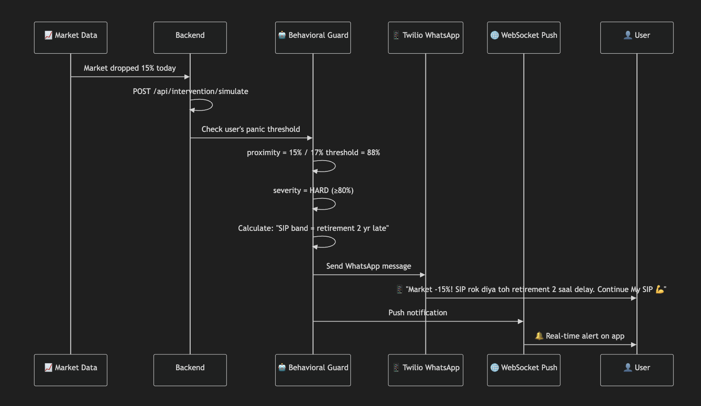

<div align="center">

### Team CodeHashiras

# ASTRAGUARD
### **Behavioral Financial Intelligence for the Real World**
*An AI-native financial guidance platform that combines deterministic finance engines, behavioral intervention, compliance guardrails, and document-driven personalization.*

[](https://www.python.org/)
[](https://fastapi.tiangolo.com/)
[](https://www.langchain.com/langgraph)
[](https://www.mongodb.com/)
[](https://redis.io/)
[](https://www.trychroma.com/)
[](https://www.twilio.com/)

<br/>

<strong>Deterministic Finance.</strong> <strong>Behavioral Intelligence.</strong> <strong>Compliant AI.</strong>

<br/><br/>

<a href="#executive-summary">Executive Summary</a> •
<a href="#architecture-overview">Architecture</a> •
<a href="#visual-overview">Visuals</a> •
<a href="#api-surface">API</a> •
<a href="#local-setup">Setup</a> •
<a href="#team">Team</a>

</div>

---

## Executive Summary

AstraGuard is a financial intelligence platform engineered to make financial decision systems more adaptive, more explainable, and more behavior-aware.

Instead of stopping at calculators and static dashboards, it combines:

- deterministic finance engines for retirement planning, tax optimization, and portfolio analysis
- conversational onboarding that builds structured user context
- agentic narration and intervention layers for behavior-linked guidance
- document ingestion from real financial records
- compliance screening and auditability throughout the output path

The result is a platform that does not just compute numbers. It contextualizes them, explains them, and reacts when user behavior itself becomes the risk.

---

## Mission

**AstraGuard** is a financial intelligence system built to prevent costly human mistakes, not just calculate numbers.

Most financial tools stop at dashboards and calculators. AstraGuard goes further by combining:

- deterministic financial engines for **FIRE**, **tax optimization**, and **portfolio X-ray**
- AI-driven onboarding that builds a user's **Financial DNA** and **Behavioral DNA**
- compliance-aware narration guarded by regulatory checks
- proactive intervention logic for panic-risk behavior
- document ingestion for **Form 16** and **CAS**-based personalization
- real-time delivery paths such as WebSockets and WhatsApp escalation

This repository contains the backend platform, agent layer, ingestion workflows, and shared contracts that power that experience.

---

## What AstraGuard Actually Does

### Personalized Onboarding
- extracts financial context from conversation
- tracks completion progress
- stores a live user profile over time

### FIRE Planning
- calculates retirement corpus targets
- estimates retirement age under current vs improved SIP plans
- quantifies emergency fund and insurance gaps

### Tax Optimization
- compares old vs new regime
- computes recognized deductions and savings
- surfaces missed deduction opportunities

### Portfolio X-Ray
- calculates portfolio and fund-level XIRR
- analyzes overlap risk across mutual funds
- estimates expense drag and direct-vs-regular plan leakage
- generates rebalancing guidance

### Behavioral Guard
- detects panic-risk based on behavioral profile and market stress
- simulates real consequences of stopping SIPs
- can trigger push/WhatsApp-style interventions

### Document Ingestion
- parses **Form 16** PDFs
- parses **CAS** statements
- converts extracted data into downstream financial calculations

### Compliance + Explainability
- regulatory text retrieval through ChromaDB
- output screening for risky claims
- human-readable audit narration for calculation trails

---

## Product Philosophy

AstraGuard follows a strict architecture principle:

> **LLMs explain, classify, narrate, and intervene.  
> Deterministic Python code performs the financial math.**

That separation is the core quality bar of the project.

It keeps the system:

- auditable
- safer under regulatory pressure
- easier to test
- more reliable for user-facing finance decisions

---

## System Design Principles

AstraGuard is built around a small set of explicit engineering principles:

- **Deterministic math first**  
  Financial calculations come from explicit Python engines, not generated text.

- **AI as an augmentation layer**  
  Agents classify, narrate, summarize, and intervene, but they do not own the source-of-truth math.

- **Behavior is a first-class input**  
  Panic thresholds, SIP pauses, and intervention timing are part of the system model, not UI decoration.

- **Compliance is embedded**  
  Regulatory checks are integrated into the response path rather than added as an afterthought.

- **Pragmatic architecture over theatrics**  
  The codebase prioritizes working flows, inspectable logic, and testable boundaries.

---

## Architecture Overview

```text
┌───────────────────────────────────────────────────────────────────────┐
│                              FRONTEND                                 │
│        Onboarding • FIRE • Tax • Portfolio • Behavioral Alerts       │
└───────────────────────────────┬───────────────────────────────────────┘
                                │
                                ▼
┌───────────────────────────────────────────────────────────────────────┐
│                        FASTAPI BACKEND                                │
│                                                                       │
│  /api/onboard       /api/fire        /api/tax                         │
│  /api/portfolio     /api/behavioral  /api/intervention                │
│  /api/upload-form16 /api/upload-cas  /api/jobs                        │
│  /ws/{user_id}                                                         │
└───────────────────────────────┬───────────────────────────────────────┘
                                │
                    ┌───────────┴───────────┐
                    ▼                       ▼
        ┌─────────────────────┐   ┌─────────────────────┐
        │ Deterministic Math  │   │  Agent Orchestrator │
        │ FIRE • Tax • XIRR   │   │ DNA • Narration     │
        │ Overlap • Expense   │   │ Behavioral Guard    │
        └─────────────────────┘   │ Regulator Guard     │
                                  │ Literacy • Audit    │
                                  └─────────────────────┘
                                            │
                                            ▼
                           ┌────────────────────────────────┐
                           │ Integrations & Persistence     │
                           │ MongoDB • Redis • ChromaDB    │
                           │ Groq • Twilio • PDF Parsers   │
                           └────────────────────────────────┘
```

---

## Visual Overview

<div align="center">


<p>
  <strong>System Architecture</strong><br/>
  Input data, deterministic financial engines, and the agent orchestration layer working together in a single decision pipeline.
</p>

</div>

<div align="center">



<p>
  <strong>Behavioral Intervention Flow</strong><br/>
  Market stress enters through the backend, passes through Behavioral Guard, and fans out through WhatsApp and WebSocket delivery channels.
</p>

</div>

---

## Frontend Integration Posture

The backend is structured to support a dedicated product frontend across:

- guided onboarding
- FIRE planning
- tax decision support
- portfolio X-ray dashboards
- behavioral intervention surfaces

The intended integration model is:

- stable request and response contracts
- UI-friendly derived fields when required
- consistent narration keys for human-readable explanation
- asynchronous polling or WebSocket delivery where flows are stateful

This repository is therefore not just an experimentation sandbox. It is organized to back a real application experience.

---

## Repository Layout

```bash
AstraGuard/
├── agents/                          # Orchestrator and domain agents
├── integrations/                    # Groq, Twilio, ChromaDB, extractors
├── prompts/                         # Prompt packs for each agent
├── schemas/                         # Shared data contracts
├── data/sebi_rules/                 # Regulatory text corpus for RAG
├── scripts/                         # Seeding and support scripts
├── tests/                           # Root agent/integration tests
├── Backend/
│   ├── services/backend/app/
│   │   ├── api/                     # FastAPI routes
│   │   ├── engines/                 # FIRE, tax, portfolio engines
│   │   ├── pipelines/               # CAMS/Form16 ingestion flows
│   │   ├── repositories/            # MongoDB adapters
│   │   ├── services/                # Jobs, websockets, audit, secrets
│   │   └── core/                    # Settings, DB manager, errors
│   └── tests/                       # Backend-focused tests
├── requirements.txt
├── Dockerfile
└── README.md
```

---

## Core Modules

### 1. FastAPI Service Layer
The operational backend lives under:

- [`Backend/services/backend/app/main.py`](/Users/theankit/Documents/AstroGuard/Backend/services/backend/app/main.py)

It wires:

- REST APIs
- WebSocket updates
- startup/shutdown DB lifecycle
- artifact hosting

### 2. Deterministic Engines
Business-critical financial logic lives in:

- [`Backend/services/backend/app/engines/fire_engine.py`](/Users/theankit/Documents/AstroGuard/Backend/services/backend/app/engines/fire_engine.py)
- [`Backend/services/backend/app/engines/tax_engine.py`](/Users/theankit/Documents/AstroGuard/Backend/services/backend/app/engines/tax_engine.py)
- [`Backend/services/backend/app/engines/portfolio_engine.py`](/Users/theankit/Documents/AstroGuard/Backend/services/backend/app/engines/portfolio_engine.py)

These are the source of truth for calculations.

### 3. Agent System
The agent runtime begins at:

- [`agents/orchestrator.py`](/Users/theankit/Documents/AstroGuard/agents/orchestrator.py)

Supporting agents include:

- DNA extraction
- FIRE narration
- tax narration
- portfolio narration
- behavioral guard
- regulator guard
- literacy agent
- life simulator
- audit narrator

### 4. Integrations
External bridges include:

- Groq LLM access
- ChromaDB RAG
- Twilio WhatsApp
- CAS extraction
- Form 16 extraction

---

## API Surface

The current backend exposes routes across five major categories.

| Domain | Endpoints |
|---|---|
| Onboarding & Chat | `POST /api/onboard`, `POST /api/chat` |
| Finance Engines | `POST /api/fire`, `POST /api/tax`, `POST /api/portfolio/xray`, `GET /api/portfolio/xray/{job_id}` |
| Behavioral & Wellness | `POST /api/behavioral/seed`, `POST /api/intervention/simulate`, `POST /api/life-event`, `GET /api/arth-score/{user_id}` |
| Documents & Ingestion | `POST /api/upload-form16`, `POST /api/upload-cas`, `POST /api/cams/agent/start`, `POST /api/form16/agent/start`, `POST /api/jobs/{job_id}/user-step` |
| Transparency & Realtime | `GET /api/audit/{calculation_id}`, `GET /health`, `WS /ws/{user_id}` |

---

## End-to-End Flow

## 1. Onboarding
- user starts a conversation
- DNA extraction agent builds financial and behavioral profile
- progress is stored to the session/user layer

## 2. Documents
- user uploads Form 16 or CAS
- extractors convert files into structured financial inputs
- extracted data is merged into user profile

## 3. Calculation
- FIRE, tax, or portfolio route calls a deterministic engine
- audit trail is generated and optionally persisted

## 4. AI Layer
- orchestrator adds narration
- regulator guard screens risky wording
- literacy agent adds explanation/quiz content
- behavioral guard can issue intervention payloads

## 5. Delivery
- response returns to frontend
- job updates can stream over WebSocket
- intervention messages can be delivered through Twilio paths

---

## Data Model

The system revolves around two user-level profile layers:

### Financial DNA
- age
- salary
- expenses
- goals
- investments
- insurance
- housing and deduction context

### Behavioral DNA
- panic threshold
- discipline score
- SIP pause history
- panic-check behavior
- recovery awareness

These profiles allow AstraGuard to move from generic advice to **user-specific consequence modeling**.

---

## Security & Compliance

### Compliance Guardrails
AstraGuard does not treat compliance as a UI disclaimer alone.

The system includes:

- prohibited phrase checks
- return-assumption checks
- tax limit validation
- regulatory context retrieval via ChromaDB

### Secret Handling
Credential-like ingestion secrets are designed to remain ephemeral:

- short-lived in-memory secret storage
- not intended for durable persistence

### Important Note
This repository is a hackathon-grade platform, not a licensed advisory service. Outputs should be treated as educational guidance and routed through the compliance layer before user-facing delivery.

---

## Local Setup

### Prerequisites
- Python `3.13+`
- MongoDB connection if persistence is required
- Redis connection if you want external cache/queue infra
- Groq API key for LLM-backed features
- optional Twilio credentials for WhatsApp intervention testing

### 1. Create a Virtual Environment

Recommended:

```bash
python3.13 -m venv venv
source venv/bin/activate
```

### 2. Install Dependencies

```bash
pip install -r requirements.txt
pip install -r Backend/services/backend/requirements.txt
```

### 3. Configure Environment

Create the appropriate `.env` file using:

- [`.env.example`](/Users/theankit/Documents/AstroGuard/.env.example)
- [`Backend/.env.example`](/Users/theankit/Documents/AstroGuard/Backend/.env.example)

At minimum, configure:

```env
GROQ_API_KEY=...
MONGODB_URI=...
REDIS_URL=...
CHROMADB_PERSIST_DIR=./chroma_data
TWILIO_ACCOUNT_SID=...
TWILIO_AUTH_TOKEN=...
TWILIO_WHATSAPP_FROM=whatsapp:+14155238886
```

### 4. Seed ChromaDB

```bash
python scripts/seed_chromadb.py
```

### 5. Run the Backend

From:

- [`Backend/services/backend`](/Users/theankit/Documents/AstroGuard/Backend/services/backend)

Run:

```bash
uvicorn app.main:app --host 127.0.0.1 --port 8000 --reload
```

### Quick Start

For a clean local boot path:

```bash
python3.13 -m venv venv
source venv/bin/activate
pip install -r requirements.txt
pip install -r Backend/services/backend/requirements.txt
python scripts/seed_chromadb.py
cd Backend/services/backend
uvicorn app.main:app --host 127.0.0.1 --port 8000 --reload
```

---

## Docker

This repository includes a Dockerfile at:

- [`Dockerfile`](/Users/theankit/Documents/AstroGuard/Dockerfile)

It:

- uses Python `3.13-slim`
- installs system libraries required by PDF tooling
- installs both root and backend dependency sets
- installs CPU-only PyTorch first to avoid oversized CUDA pulls
- serves FastAPI through Uvicorn

Example:

```bash
docker build -t astraguard .
docker run -p 8080:8080 --env-file .env astraguard
```

---

## Testing

The repo currently has two maintained test zones.

### Root Tests

Run from repository root:

```bash
PYTHONPATH=. venv/bin/pytest -q tests
```

### Backend Tests

Run from the `Backend/` directory:

```bash
../venv/bin/pytest -q tests
```

### Note
A plain top-level `pytest` from repo root can pick up non-test helper scripts and duplicate `tests` package names. The commands above reflect the working layout of the repository as it stands today.

---

## Current Maturity

AstraGuard is already strong in:

- deterministic finance logic
- AI orchestration structure
- ingestion scaffolding
- compliance-aware output shaping
- test coverage for core calculators and helper flows

It is still maturing in:

- durable job storage
- production-grade queueing
- full autonomous portal automation
- unified public API contracts for frontend consumption

The shortest accurate description is:

> **AstraGuard is a coherent, hackathon-grade financial intelligence backend with real engines, real orchestration, and partially scaffolded infrastructure around them.**

---

## Why This Project Is Different

Most finance apps answer:

> “What should I invest in?”

AstraGuard is built to answer:

> “What happens to *you* if you panic, delay, underinsure, miss tax structure, or ignore portfolio drag?”

That shift from static advice to **behavior-linked consequence intelligence** is the heart of the product.

---

## Deployment Notes

For local backend development, the service is typically started with Uvicorn from:

- [`Backend/services/backend`](/Users/theankit/Documents/AstroGuard/Backend/services/backend)

For containerized runs, use the included Dockerfile.

For production-facing frontend integration, the expected deployment model is:

- backend deployed independently
- frontend consuming contract-stable APIs
- live updates delivered through WebSockets for jobs and intervention events

Because ingestion, messaging, and narration depend on external services, MongoDB, Redis, Groq, and optional Twilio credentials should be treated as operational dependencies for the full system experience.

---

## Contributing

If you are extending AstraGuard, the safest workflow is:

1. keep deterministic logic inside the finance engines
2. treat agent output as narration/classification, not source-of-truth math
3. preserve compliance and auditability
4. add tests whenever route contracts or engine outputs change

Typical workflow:

```bash
git checkout -b feature/your-feature-name
git commit -m "Add your feature"
git push origin feature/your-feature-name
```

---

## Team

| Member | Role |
|---|---|
| **Devraj Sahani** | Frontend Developer |
| **Ankit Choubey** | Team Lead, AI/ML and Generative AI Developer |
| **Utkarsh Singh** | Agentic AI and ML Developer |
| **Sanklap Tiwari** | Backend Developer |

---

## Additional Documentation

For deeper internal understanding, see:

- [`REPO_ANALYSIS.md`](/Users/theankit/Documents/AstroGuard/REPO_ANALYSIS.md)
- [`AstraGuard_Execution_Bible.md`](/Users/theankit/Documents/AstroGuard/AstraGuard_Execution_Bible.md)
- [`INTEGRATION_GUIDE_FOR_ANKIT.md`](/Users/theankit/Documents/AstroGuard/INTEGRATION_GUIDE_FOR_ANKIT.md)
- [`Backend/INTEGRATION_GUIDE_FOR_ANKIT.md`](/Users/theankit/Documents/AstroGuard/Backend/INTEGRATION_GUIDE_FOR_ANKIT.md)

---

<div align="center">

### **AstraGuard**
**Deterministic Finance. Behavioral Intelligence. Compliant AI.**

*"The real financial risk is rarely missing data. It is missing judgment at the wrong time."*

</div>
